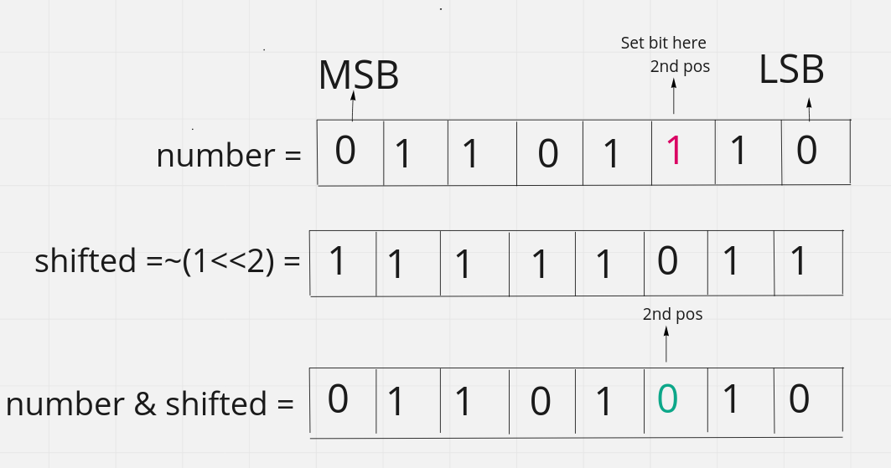

# Basic Bitwise Operation

#### 1. Set a bit on the $$n_{th}$$ position of number n:

* Left shift `1` `n` times. $temp = 1 << n$
* Do the bitwise `OR` with the `n` . $setbit = number | temp$
* If the bit is already set then it will remain the same.

Let's say we want to set bit on the $2_{nd}$ ​position of the $(106)_{2} = 01101010$

$1_{(00000001)} << 2 = 00000100 | 01101010 = (01101110 )_{10} = 110$

<figure><figcaption></figcaption></figure>

> Binary number are considered as 0 based indexing and also start from **right to left.** That means
>
> Most right part are considered as index 0 or 0th  position. This is depends on big and little endian machine. In this case we are fllowing the little endian convention.

#### 2. Clear/unset a bit from $n_{th}$ position:​

* Left shift `1` `n` times.  $temp = 1 << n$
* Do the `bitwise NOT` to unset the `bit` of the shifted bitset. `temp = ~temp`
* Now do the bitwise `AND` with the `n`. `clearbit = temp & number`

Let's say we want to set bit on the $2_{nd}$ ​position of the $(110)_{2} = 01101110$

$\sim (1_{(00000001)}) << 2 = 11111011 \\& 01101110 = (01101010 )_{10} = 106$

<figure><figcaption></figcaption></figure>

#### 3. Toggling a bit at $n_{th}$ position :

* It means if a bit is `0` then it will be `1` and if it is `1` then it will be `0`
* Left shift `1` `n` times. $temp = 1 << n$
* Do `XOR` with the number. $togglebit = number \oplus temp$

Let's say we want to toggle bit on the $2_{nd}$ position of the $(110)_{2} = 01101110$

$1_{(00000001)} << 2 = 00000100 \oplus 01101110 = (01101010 )_{10} = 106$

#### 4. Checking if bit at nth position is set or unset:
* Left shift `1` `n` times. $temp = 1 << n$
* Do the bitwise `AND` with the `n` . $is_set = number \\& temp$
* If `is_set == 0` then this not set otherwise the bit is `set`

$1_{(00000001)} << 2 = 00000100 \\& 01101010 = (00000000 )_{10} = 0$. Means not set.

$1_{(00000001)} << 2 = 00000100 \\& 01101110 = (00000100 )_{10} = 4$. Means this bit is set.
