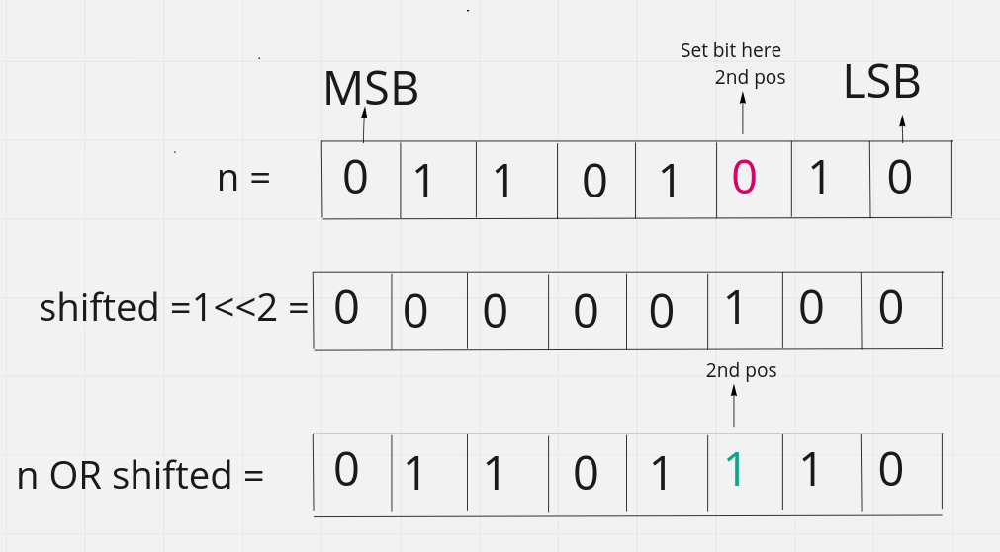
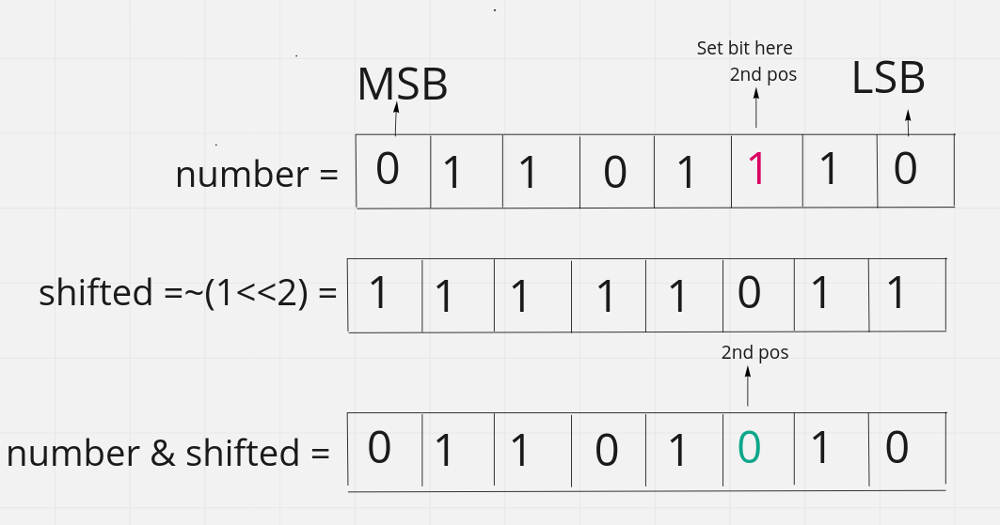

# Basic Bitwise Operation

#### 1. Set a bit on the $n_{th}$ position of number n:

* Left shift `1` `n` times. $temp = 1 << n$
* Do the bitwise `OR` with the `n` . $setbit = number | temp$
* If the bit is already set then it will remain the same.

Let's say we want to set bit on the $2_{nd}$ ​position of the $(106)_{2} = 01101010$

$1_{(00000001)} << 2 = 00000100 | 01101010 = (01101110 )_{10} = 110$

<figure><figcaption></figcaption></figure>

> Binary number are considered as 0 based indexing and also start from **right to left.** That means
>
> Most right part are considered as index 0 or 0th  position. This is depends on big and little endian machine. In this case we are fllowing the little endian convention.

#### 2. Clear/unset a bit from $n_{th}$ position:​

* Left shift `1` `n` times.  $temp = 1 << n$
* Do the `bitwise NOT` to unset the `bit` of the shifted bitset. `temp = ~temp`
* Now do the bitwise `AND` with the `n`. `clearbit = temp & number`

Let's say we want to set bit on the $2_{nd}$ ​position of the $(110)_{2} = 01101110$

$\sim (1_{(00000001)}) << 2 = 11111011 \& 01101110 = (01101010 )_{10} = 106$

<figure><figcaption></figcaption></figure>

#### 3. Toggling a bit at $n_{th}$ position :

* It means if a bit is `0` then it will be `1` and if it is `1` then it will be `0`
* Left shift `1` `n` times. $temp = 1 << n$
* Do `XOR` with the number. $togglebit = number \oplus temp$

Let's say we want to toggle bit on the $2_{nd}$ position of the $(110)_{2} = 01101110$

$1_{(00000001)} << 2 = 00000100 \oplus 01101110 = (01101010 )_{10} = 106$

#### 4. Checking if bit at nth position is set or unset:

* Left shift `1` `n` times. $temp = 1 << n$
* Do the bitwise `AND` with the `n` . $is_set = number \& temp$
* If `is_set == 0` then this not set otherwise the bit is `set`

$1_{(00000001)} << 2 = 00000100 \& 01101010 = (00000000 )_{10} = 0$. Means not set.

$1_{(00000001)} << 2 = 00000100 \& 01101110 = (00000100 )_{10} = 4$. Means this bit is set.

#### 5. Inverting every bit of a number/1’s complement:

* Just using Bitwise `NOT` to get the `1's` complement.

$\sim (01101010) = (10010101 )_{10} = 149$

#### 6. Two’s complement of the number: 

* 2’s complement of a number is `1’s complement + 1`.

$\sim(01101010) + 1 = 10010101 + 1 = (10010110 )_{10} = -106$

#### 7. Sum of two number:

* Create full adder using half adder.
* We can add the carry bit again and again until the carry is `0`. 
* $S=A \oplus B$ and $C_{out} = A \& B$

Let's say we want to add `15 + 12` = `00001111 + 00001100`
* Do $\oplus$ operation -> $00001111 \oplus 00001100 = 00000011 and C_{out} = 00001111 \& 00001100 = 00001100$
* This carry from $2_{nd}$ position. should be add to $3_{rd}$ position of `00000011`. 
So, `00001100` 2nd position `1` should be added to the `00000011` 3rd postion which is `0`.
We can do this by left shift the carray output by `1` then the value will be $00001100 << 1 = 00011000$.
* Now the carry shift to the `3rd` position where we should add this carry. $new_sum = 00000011 \oplus 00011000 = 00011011$
and $C_{out} = 00000011 \& 00011000 = 0000$ so there is no carry left so `00011011` is the answer.
* $(00011011)_{10} = 27 = 15 + 12$

> Binary indexed should be start from right most side.

#### 8. Find log base 2 of 32 bit integer:

* Keep doing right shift until the the shift value is 0. Keep count of shifting. The count of shift is the answer.

#### 9. Checking if given 32 bit integer is power of 2:

* All the power of 2 have only single bit set `e.g. 16 (00010000)`. If we minus `1` from this, all the bits from LSB to set bit get toggled, `i.e., 16-1 = 15 (00001111)`. Now if we AND `n` with `(n-1)` and the result is `0` then we can say that `n` is power of `2` otherwise not. We have to take extra care when `n = 0`.
* if $n \& (n-1) = 0$ then it is power of `2`

#### 10. $\sim (x + 1) + 1 = \sim x$

Let's say $x=10110101$. We will run the above operation bellow

$\sim (10110101+00000001) + 00000001 = \sim 10110110 + 00000001$

$= 01001001 + 00000001 = 01001010$

$= 01001010 = \sim x = \sim 10110101 = 01001010$

#### 11. Flip the right most bit:

* $x \oplus 1$

#### 12. Unset the right most set bit:

* $ x \& (x-1)$

### Reference:
* https://www.geeksforgeeks.org/bitwise-hacks-for-competitive-programming/
* https://www.youtube.com/watch?v=1um-WUyjess
* https://codeforces.com/blog/entry/73490
* https://www.youtube.com/watch?v=UPVoGMZWQMU&t=286s
* https://www.geeksforgeeks.org/bitwise-hacks-for-competitive-programming/
* https://www.geeksforgeeks.org/modify-bit-given-position/
* https://www.geeksforgeeks.org/bit-tricks-competitive-programming/
* [count set bit](https://www.geeksforgeeks.org/count-set-bits-in-an-integer/)
* [https://www.sciencedirect.com/topics/engineering/binary-multiplication](https://www.sciencedirect.com/topics/engineering/binary-multiplication#:~:text=The%20product%20of%20multiplying%20any,adding%20the%20shifted%20numbers%20together.)

