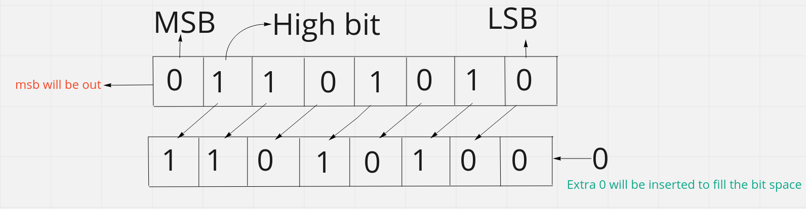
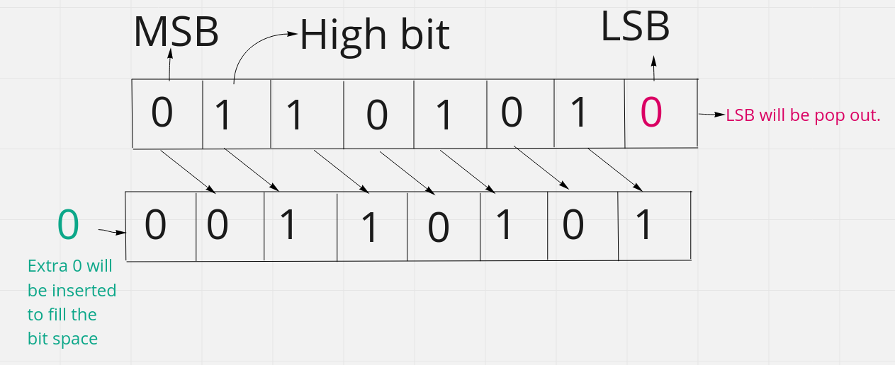

# Bitwise Shift

The bitwise shift operators move the bit values of a binary object. The left operand specifies the value to be shifted. The right operand specifies the number of positions that the bits in the value are to be shifted. The result is not an lvalue. Both operands have the same precedence and are left-to-right associative.

### MSB:

The most significant bit (MSB) is **the bit in a multiple-bit binary number with the largest value**. This is usually the bit farthest to the left, or the bit transmitted first in a sequence. For example, in the binary number `1000`, the MSB is `1`, and in the binary number `0111`, the MSB is `0`.

### LSB:

The least significant bit (**LSB**) is **the bit in a multiple-bit binary number with the largest value**. This is usually the bit farthest to the right, or the bit transmitted last in a sequence. For example, in the binary number `1000`, the LSB is `0`, and in the binary number `0111`, the MSB is `1`.

### High Bit:

The **High Bit** is **the bit in a multiple-bit binary number with the largest value**. This is usually the bit farthest to the left, or the bit transmitted first in a sequence and it should be `1`. For example, in the binary number `0010101`, the `High Bit` is `1`.

### Left Shift:

Shift `01101010` to left by 1. This is an 8-bit number.

<figure><figcaption></figcaption></figure>

#### Expression:

$$x << k = x.2^k$$\
In the above we   $106_{2} = 01101010$    left shifted by 1 . Now the value is  $(11010100)_{10}= 212$ which means\
$$106 << 1 = 106.2^1 = 212$$​

### Right Shift:

Shift `01101010` to right by 1. This is an 8-bit number.

<figure><figcaption></figcaption></figure>

#### Expression:

$$x>>k = \dfrac{x}{2^k}$$\
In the above we $106_{2} = 01101010$ right shifted by 1 . Now the value is $(00110101)_{10}= 53$ . which means\
$$106 >> 1 = \dfrac{106}{2^1} = 53$$​

> Here no floting number will be counted. Means we will get the output as an integer. Float part will be removed.

> when you store binary in memory,there as two common convention. The first convention is to store binary in memory ordered from **LSB** to **MSB**, which is referred to as **little endian**. The second convention is to store binary in memory ordered from **MSB** to **LSB**, which is referred to as **big endian**

### Reference:

* [https://www.techopedia.com/definition/8419/most-significant-bit-msb](https://www.techopedia.com/definition/8419/most-significant-bit-msb)
* [https://codeforces.com/blog/entry/73490](https://codeforces.com/blog/entry/73490)
* [https://processing.org/reference/leftshift.html](https://processing.org/reference/leftshift.html)
* [https://www.youtube.com/watch?v=AF7gueoXfLs](https://www.youtube.com/watch?v=AF7gueoXfLs)
* [https://www.ibm.com/docs/en/i/7.2?topic=expressions-bitwise-left-right-shift-operators](https://www.ibm.com/docs/en/i/7.2?topic=expressions-bitwise-left-right-shift-operators)
