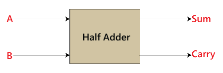

# Adders

There are two types of adders `half adder` and `full adder`  . These adders are used for add two bits and output it as a result.

### Half Adder:

Half adder is the simplest of all adder circuits. Half adder is a combinational arithmetic circuit that adds two numbers and produces a sum bit (s) and carry bit (c) both as output. The addition of 2 bits is done using a combination circuit called a Half adder. The input variables are augend and addend bits and the output variables are sum & carry bits. A and B are the two input bits.

<figure><figcaption></figcaption></figure>

#### Truth Table

| A | B | Sum(S)              | Carry(C) |
| - | - | ------------------- | -------- |
| 0 | 0 | \[=0+0]          0  | 0        |
| 0 | 1 | \[=0+1]           1 | 0        |
| 1 | 0 | \[=1+0]           1 | 0        |
| 1 | 1 | \[=(1+1)=10]   0    | 1        |

We can compile the flowing expression for considering this truth table

$$Sum(S) = \bar{A}.B + A.\bar{B} = A \oplus B$$\
$$Carry(C) = A.B$$​

#### Half Adder logical circuit

<figure><figcaption></figcaption></figure>

This **Half Adder** works perfectly if there is no incoming carry from the previous bit. Let**'**s say we want to add **A =** **15** and  **B = 12**

****$$A_{2} = 1111,  B_{2} = 1100$$****

These two inputs will treat as a series of bits.

| A | B | S | C |
| - | - | - | - |
| 1 | 1 | 0 | 1 |
| 1 | 1 | 0 | 1 |
| 1 | 0 | 1 | 0 |
| 1 | 0 | 1 | 0 |

​So, the output will be

$$S= 0011$$\
$$C= 1100$$

But actual output should be `27` or `11011`

This is the limitation of **Half Adder** it only calculates accurate value if there is no carry.​ To solve this issue **Full Adder** has been introduced.

### Full Adder (FA):

Full Adder is the adder that adds three inputs and produces two outputs. The first two inputs are A and B and the third input is an input carry as C-IN. The output carry is designated as C-OUT and the normal output is designated as S which is SUM.

<figure><figcaption></figcaption></figure>

### Truth Table:

| A | B | $C\_in$ | S | $C\_out$ |
| - | - | ------- | - | -------- |
| 0 | 0 | 0       | 0 | 0        |
| 0 | 0 | 1       | 1 | 0        |
| 0 | 1 | 0       | 1 | 0        |
| 1 | 0 | 0       | 1 | 0        |
| 1 | 0 | 1       | 0 | 1        |
| 1 | 1 | 0       | 0 | 1        |
| 0 | 1 | 1       | 0 | 1        |
| 1 | 1 | 1       | 1 | 1        |

#### Expressions:

$$S_{sum} = \bar{A}.\bar{B}.C_{in} + \bar{A}.B.C_{in} + A.\bar{B}.\bar{C_{in}} + A.B.C_{in}$$​\
&#x20;         $$= \bar{A}(\bar{B}.C_{in} + B.C_{in}) + A(\bar{B}.\bar{C_{in}} + B.C_{in})$$\
&#x20;         $$= \bar{A}(B \oplus C) + A(\overline{B \oplus C_{in}})$$\
&#x20;         $$= A \oplus B \oplus C$$​

&#x20;  &#x20;

### Reference:

* [https://www.sciencedirect.com/topics/computer-science/full-adder](https://www.sciencedirect.com/topics/computer-science/full-adder)
* [half\__adder\_geeks\_for\_geeks_](https://www.geeksforgeeks.org/half-adder-in-digital-logic/)__
* __

