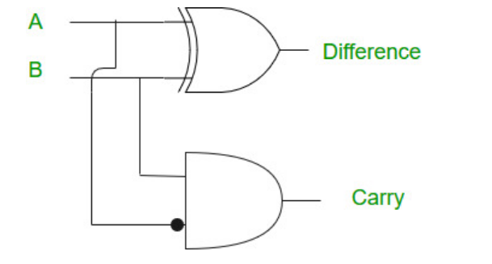

# Substractors

**Half Subtractor (HS):** Half subtractor is a combination circuit with two inputs and two outputs which is **difference** and **borrow**. It produces the difference between the two binary bits at the input and also produces an output (Borrow) to indicate if a 1 has been borrowed. In the subtraction (A-B), A is called a **Minuend bit** and B is called as **Subtrahend bit.**

<figure><figcaption></figcaption></figure>

#### Truth Table:

| A | B | Diff | Borrow |
| - | - | ---- | ------ |
| 0 | 0 | 0    | 0      |
| 0 | 1 | 1    | 1      |
| 1 | 0 | 1    | 0      |
| 1 | 1 | 0    | 0      |

<figure><figcaption></figcaption></figure>

#### Expressions:

$$Diff = \bar{A}.B + A.\bar{B} = A \oplus B$$\
$$Borrow = \bar{A}.B$$

### Reference:

* [https://www.geeksforgeeks.org/half-subtractor-in-digital-logic/](https://www.geeksforgeeks.org/half-subtractor-in-digital-logic/)
