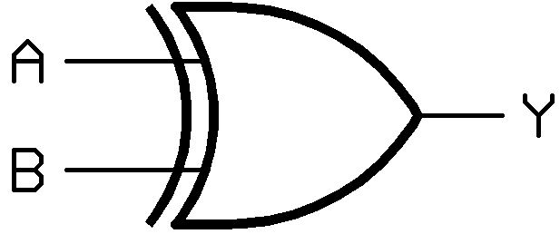

# Logic Gates

A logic gate is a device that acts as a building block for digital circuits. They perform basic logical functions.

There are several logic gates. They are given bellow.&#x20;

### AND:&#x20;

<figure><figcaption></figcaption></figure>

It takes two input and output 1 if two input bits are the same otherwise 0.

#### Truth table

| A | B | A.B |
| - | - | --- |
| 0 | 0 | 0   |
| 0 | 1 | 0   |
| 1 | 0 | 0   |
| 1 | 1 | 1   |

### OR:&#x20;

<figure><figcaption></figcaption></figure>

#### Truth table

| A | B | A+B |
| - | - | --- |
| 0 | 0 | 0   |
| 0 | 1 | 1   |
| 1 | 0 | 1   |
| 1 | 1 | 1   |

### XOR:

<figure><figcaption></figcaption></figure>

It takes 2 input and output 0 if both bits are the same otherwise 1.

$$ Y= A \oplus B $$

$$ Y = A.\bar{B} + \bar{A}.B $$

#### Notes:

$$A \oplus A = 0$$

$$A \oplus \bar{A} = 1$$

$$A \oplus 0 = A$$

$$A \oplus 1 = \bar{A}$$

| A | B | A $\oplus$ b |
| - | - | ------------ |
| 0 | 0 | 0            |
| 0 | 1 | 1            |
| 1 | 0 | 1            |
| 1 | 1 | 0            |

### NOT:

<figure><figcaption></figcaption></figure>

#### Truth Table

| A | $\bar{A}$ |
| - | --------- |
| 0 | 1         |
| 1 | 0         |

### Universal gate

A universal gate is a gate which can implement any Boolean function without need to use any other gate type. There are two universal gates **NAND** and **NOR** gate. That means using these one of them we can implement any gate like `AND, OR, XOR, NOT` .&#x20;

### NAND:

The NAND gate represents the **complement** of the **AND** operation. Its name is an abbreviation of **NOT AND**.

#### Truth Table

| A | B | (A.B)' |
| - | - | ----------- |
| 0 | 0 | 1           |
| 0 | 1 | 1           |
| 1 | 0 | 1           |
| 1 | 1 | 0           |

Any logic gate can be implemented by this gate.

* Implement `NOT` gate only used of `NAND`\
  or 
* Implement `AND` gate\
  
* Implement `OR` gate\
  

### NOR:

The `NOR` gate represents the **complement** of the `OR` operation. Its name is an abbreviation of **NOT OR**.

#### Truth Table

| A | B | (A+B)' |
| - | - | ----------- |
| 0 | 0 | 1           |
| 0 | 1 | 0           |
| 1 | 0 | 0           |
| 1 | 1 | 0           |

### Logic gate operator in python

| Syntax | Gate        | Application                                                                                                                                                                                                                                                                                   |
| ------ | ----------- | --------------------------------------------------------------------------------------------------------------------------------------------------------------------------------------------------------------------------------------------------------------------------------------------- |
| `&`    | Bitwise AND | <ul><li>To set up a mask to check the values of specific bits.</li></ul>                                                                                                                                                                                                                      |
| `\|`   | Bitwise OR  | <ul><li>To add two numbers if there is no carry involved.</li></ul>                                                                                                                                                                                                                           |
| `^`    | Bitwise XOR | <ul><li>To toggle bits or swap two variables without using a third temporary variable.</li><li>To find specific types of numbers (e.g., odd) in a series of numbers (e.g., all even).</li><li>To find nonrepeating elements.</li><li>To detect if two integers have opposite signs.</li></ul> |
| `~`    | Biwise NOT  | <ul><li>To flip or invert bits.</li></ul>                                                                                                                                                                                                                                                     |

### Reference

* [Codeforce blog](https://codeforces.com/blog/entry/73490)
* [Geeksforgeeks](https://www.geeksforgeeks.org/bitwise-operators-in-c-cpp/)
* [Logic gates](https://www.techtarget.com/whatis/definition/bitwise)
* [https://www.tutorialspoint.com/digital\_circuits/digital\_circuits\_logic\_gates.htm](https://www.tutorialspoint.com/digital\_circuits/digital\_circuits\_logic\_gates.htm)
* [http://www.ee.surrey.ac.uk/Projects/CAL/digital-logic/gatesfunc/index.html](http://www.ee.surrey.ac.uk/Projects/CAL/digital-logic/gatesfunc/index.html)
