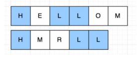
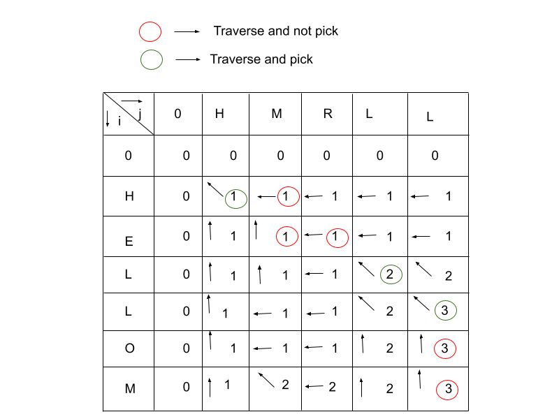

# Longest Common Subsequence

<figure><figcaption></figcaption></figure>

### Substring:

Substring is a continuous(contiguous) sequence of a given string. It means that it will flow the not only order but also postion of charecter.
eg. Sub stirng of `tree` is 
‘t,’ ‘r,’ ‘e,’ ‘tr,’ ‘tre,’ ‘tree,’ ‘re,’ ‘ree,’ ‘ee’ 
But 'te' not a substring as this is not countinuous sequence.

* If the string has a character repeated twice as in the above example of “tree,” we have ‘e’ repeated twice, so ‘e’ will be counted only once as a substring.

* An empty string is a substring of any string.

* The order of elements should be the same as the original string.

#### Expression of finding substring:

$f(sub\\_strings) = \dfrac{n*(N+1)}{2}$

> Same rules apply for subarry it will name as continuous memory block.

### Subsequence:

A subsequence is a sequence that can be derived from another sequence of elements without changing the order of the remaining elements. In another
words any string that can be obtained by deleting zero or more symbols from a given string.

For example: {A, B, D} is one of the subsequences of the sequence {A, B, C, D, E} obtained after removing {C} and {E}.

For this `array = [5,6,7,8]` array subsequence are:

`{5}, {6}, {7}, {8}, {5,6}, {5,7},{5,8}, {6,7}, {6,8}, {7,8}, {5,6,7}, {5,6,8}, {5,7,8}, {6,7,8}, {5,6,7,8}, {}.`

#### Expression of finding subsequence:

$f(sub\\_sequence) = 2^n$

### Longest Common Subsequence (LCS):

The longest common subsequence **(LCS)** is defined as the longest subsequence that is common to all the given sequences, provided that the elements of the subsequence are not required to occupy consecutive positions within the original sequences.

### Find (LCS):

We need to find the **LCS** from the given strings:

<figure><figcaption></figcaption></figure>

Here, `HLL` is the longest common subsequence which length is `3`.

### Recursive Solution:

* We will start to from `i`, `j` whre `i=sequence_1 index` and `j=sequence_2 index`.

* Now for the position of `i`, `j` there is two situation

  * `str1[i] = str2[j]`
  * `str1[i] != str2[j]`

* Now for `str[i] != str[j]` there is also 2 situation

  * We can get longest common sub sequence with considering the `str1[i]` and without considering the `str2[j]`. Means `str1[i]` and `str2[j+1]`
  * We can get longest common sub sequence with considering the `str2[j]` and without considering the `str1[i]`. Means `str1[i+1]` and `str2[j]`

  > We need to take longest from this 2 situation.

### Implementation:

```python
class LCS:
    def lcs_recursive(self, seq_1: str, seq_2: str, index_i=0, index_j=0) -> int:
        # If any index is goes to the corespoinding sequence end then return 0.
        if index_i >= len(seq_1) or index_j >= len(seq_2):
            return 0
        
        # Storing the ans
        ans = 0
        # Find LCS when both char is same.
        if seq_1[index_i] == seq_2[index_j]:
            ans = 1 + self.lcs_recursive(seq_1, seq_2, index_i+1, index_j+1)
        # Find LCS when both char is not same.
        else:
            ans = max(
                self.lcs_recursive(seq_1, seq_2, index_i, index_j+1),
                self.lcs_recursive(seq_1, seq_2, index_i+1, index_j)
            )
        
        return ans
    
    def lcs_recursive_dp(self, seq_1: str, seq_2: str, index_i=0, index_j=0, dp=[]) -> int:
    # Initialize the dp
    if not len(dp):
        dp = [[-1 for x in range(len(seq_2))] for y in range(len(seq_1))]
    # If any index is goes to the corespoinding sequence end then return 0.
    if index_i >= len(seq_1) or index_j >= len(seq_2):
        return 0
    if dp[index_i][index_j] != -1:
        return dp[index_i][index_j]
    # Storing the ans
    ans = 0
    # Find LCS when both char is same.
    if seq_1[index_i] == seq_2[index_j]:
        ans = 1 + self.lcs_recursive_dp(seq_1, seq_2, index_i+1, index_j+1, dp)
    # Find LCS when both char is not same.
    else:
        ans = max(
            self.lcs_recursive_dp(seq_1, seq_2, index_i, index_j+1, dp),
            self.lcs_recursive_dp(seq_1, seq_2, index_i+1, index_j, dp)
        )
    dp[index_i][index_j] = ans

    return dp[index_i][index_j]
```

### Iterative Solution:

For iterative solution we've to look at the table how table is updating.

* If `str[i] == str2[j]` then we will sum `1` with the value of diagonnaly. $dp[i][j] = 1 + dp[i-1][j-1]$

* If `str[i] != str2[j]` then we will take the maximum of the **left** and **upper** side. $dp[i][j] = max(dp[i][j-1], d[i-1][j])$

* After the all iteration we will found the anser in $dp[len(str1)-1][len(str2)-1]$

<figure><figcaption></figcaption></figure>

```python
class LCS:
    def lcs_iterative_dp(self, seq_1: str, seq_2: str) -> int:
        # Initialize the dp
        dp = [[0]*10000]*10000

        # Another way is to start from end to start. Then this language chages will not occure.
        for i, val_i in enumerate(seq_1):
            for j, val_j in enumerate(seq_2):
                if val_i == val_j:
                    # For other language this need to change. As dp[-1][-1] mean the last value of the dp.
                    dp[i][j] = 1 + dp[i-1][j-1]
                else:
                    # For other language this need to change. As explain above.
                    dp[i][j] = max(dp[i][j-1], dp[i-1][j])
        
        return dp[len(seq_1)-1][len(seq_2)-1]
```

### Time Complexity:

$O(N*M)$

> [Source code](lcs.py)

### Reference:

* https://www.codingninjas.com/blog/2021/09/18/subsequence-vs-substring/

* http://www.shafaetsplanet.com/?p=3602

