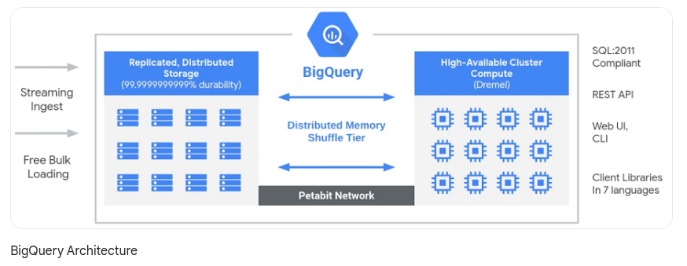
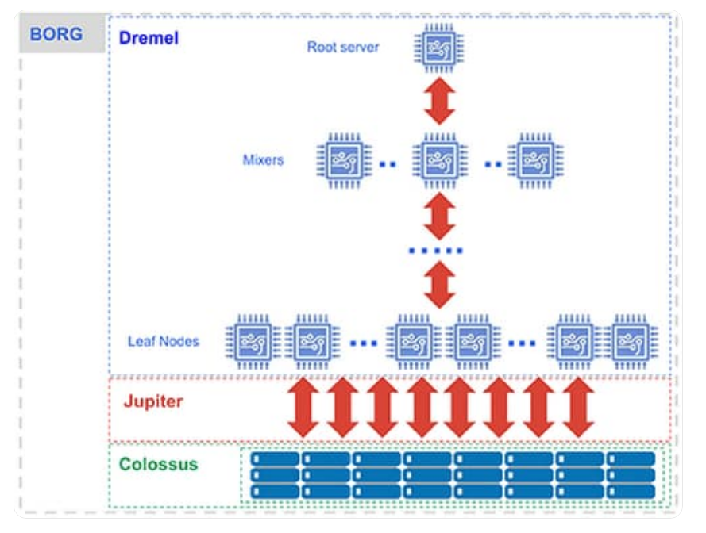

# GCP BigQuery

### Database:

A database is an organized collection of structured information, or data, typically stored electronically in a computer system. In another words
it stores such kind of data that is required to power up an application. Database is introduced at **1960s**.

### Data warehouse:

A data warehouse stores current and historical data from one or more systems in a predefined and fixed schema, which allows business analysts and data scientists to easily analyze the data.

Common property of **data warehouse**: 

* This is introduced in **1980s**.
* Used in business inteligence reporting.
* Mostly relational in nature.
* Sql queries are used for data analysis.
* It stores structured/ semi structured data.

### Datamart:

A data mart is a subset of a data warehouse focused on a particular line of business, department, or subject area. Data marts make specific data available to a defined group of users, which allows those users to quickly access critical insights without wasting time searching through an entire data warehouse.

### Data lake:

A data lake is a centralized repository designed to store, process, and secure large amounts of structured, semistructured, and unstructured data which allows business analysts and data scientists to easily analyze the data. Data lake is introduced at **2010** to overcome the limitation of data warehouse.

### Database vs Data warehouse vs Data lake:

|          |Database | Data warehouse | Data lake|
|----------|---------|----------------|----------|
|**Work loads**| Operational and transactional | Analytical | Analytical|
|**Data type**| Structured or semi-structured| Structured or semi-structured | Structured, semi-structured and unstructured |
|**Schema Flexibility**| Rigid or flexible schema depending on database type | Pre-defined and fixed schema definition for ingest (schema on write and read)| No schema definition required for ingest|
|**Data Freshness** | Real time| May not be up-to-date based on frequency of ETL processes| May not be up-to-date based on frequency of ETL processes|
|**Users**| Application developers | Business analysts and data scientists| Business analysts, application developers, and data scientists|
|**Pros**| Fast queries for storing and updating data | The fixed schema makes working with the data easy for business analysts | Easy data storage simplifies ingesting raw data A schema is applied afterwards to make working with the data easy for business analysts Separate storage and compute|
|**Cons**| May have limited analytics capabilities | Difficult to design and evolve schema Scaling compute may require unnecessary scaling of storage,because they are tightly coupled | Requires effort to organize and prepare data for use|

> **ETL:** Which stands for extract, transform and load, is a data integration process that combines data from multiple data sources into a single, consistent data store that is loaded into a data warehouse or other target system.

### GCP BigQuery:

Google BigQuery is a serverless, highly scalable data warehouse that comes with a built-in query engine. The query engine is capable of running SQL queries on terabytes of data in a matter of seconds, and petabytes in only minutes. You get this performance without having to manage any infrastructure and without having to create or rebuild indexes.

Common properties of **BigQuery**:

* It is serverless.
* Real-time analytics.
* Automatic high availability and scalability.
* It use SQL to analyze the data.
* Ideal for Datalake and Data warehouse.
* The storage and computate parts are separate.
* Automatic backup and easy restore.
* Flexible pricing models.
* It supports 

### Architecture of BigQuery:

BigQuery has three main part.

* **Storage:** Data is stored in a structure table that enables to use SQL for quering and analysis the data. 
* **Ingestion:** Big query is integrated with the rest of the data analytics platform of  Google. You can upload data from cloud storage. Also you can streaming data from cloud dataflow, build an **ETL** pipeline using cloud data fusion, import data from a variety of file formats or use the combination of one of this.
* **Quering:** BigQuery supports ** ANSI-compliant Structured Query Language**.

<figure><figcaption></figcaption></figure>

Under the hood, BigQuery employs a vast set of multi-tenant services driven by low-level Google infrastructure technologies like **Dremel, Colossus, Jupiter and Borg**.

### Reference:

* [Database vs Data warehouse vs Data lake](https://www.mongodb.com/databases/data-lake-vs-data-warehouse-vs-database#:~:text=A%20database%20stores%20the%20current,to%20easily%20analyze%20the%20data.)
* [Database](https://www.oracle.com/database/what-is-database/)
* [Database](https://www.oracle.com/database/what-is-database/)
* [Data Mart](https://www.oracle.com/autonomous-database/what-is-data-mart/)
* [Data Mart(ibm)](https://www.ibm.com/cloud/learn/data-mart#:~:text=A%20data%20mart%20is%20a,through%20an%20entire%20data%20warehouse.)
* [ETL](https://www.ibm.com/cloud/learn/etl#:~:text=ETL%2C%20which%20stands%20for%20extract,warehouse%20or%20other%20target%20system.)
* [Data warehouse and Data lake(youtube)](https://www.youtube.com/watch?v=Mk6DazkDWoA)
* [GCP BigQuery](https://www.oreilly.com/library/view/google-bigquery-the/9781492044451/ch01.html)
* [GCP BigQuery(google)](https://cloud.google.com/blog/products/data-analytics/new-blog-series-bigquery-explained-overview)
* [Under the hood BigQuery](https://cloud.google.com/blog/products/bigquery/bigquery-under-the-hood)
* [BigQuery(youtube)](https://www.youtube.com/watch?v=X0-vsku-wtQ)
* [BigQuery(youtube)](https://www.youtube.com/watch?v=d3MDxC_iuaw)
* [BigQuery analyze (youtube)](https://www.youtube.com/watch?v=Wx-aEcTf2h4)
