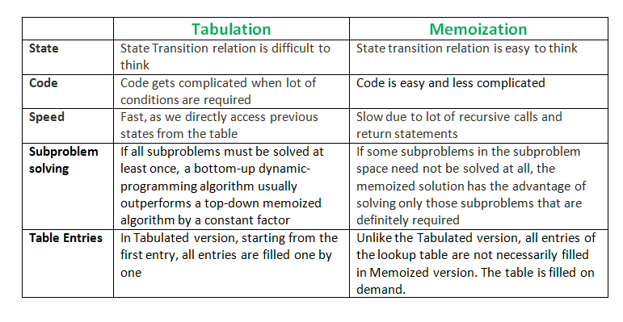

# Dynamic Programming

### Introduction

Dynamic programming is an approach/technique used to solve the complex problem by **breaking down** the problem into **sub-problems** and **storing** the results of the **sub-problem** to avoid the re-computation of the same sub-problem again and again.

### Properties

* Overlapping Subproblem
* Optimal Substructure

### Overlapping Subproblems:

After breaking down the main problem into **sub-problems** if some of those **sub-problem** **results** are **needed or re-calculated** again and again to calculate another **sub-problem result** then those sub-problems are called **overlapping subproblems** as they are overlapped.

Let's consider about the fibonaccai number calculation:

**Fibonacci sequence:** 0, 1, 1, 2, 3, 5, 8, 13, 21, 34, ... ...\
Here we can see that&#x20;

* 1st fib is 0
* 2nd fib is 1
* 3rd fib is 1 which is equal of (1st fib + 2nd fib) = (0+1)
* 4th fib is 2 which is equal of (1 + 1) = (2nd fib + 3rd fib)
* 5th fib is 3 is equal of (2 + 1) = (4th fib + 3rd fib)

We can say that $fib(n) = fib(n-1) + fib(n+2)$

If we draw a tree for $$fib(7)$$

Here we can see we need to re-calculate the value $$fib(2), fib(3), fib(4), fib(5)$$​. Also, each of them is a subproblem. As these subproblem results are needed again and again to calculate other subproblems, these subproblems are called overlapping subproblems.

### Optimal Substructure

&#x20;**** A given problem has Optimal Substructure Property if the optimal solution of the given problem can be obtained by using optimal solutions of its subproblems.&#x20;

In another word, the Optimal substructure is just an equation that relates the solution of a larger problem to the solution of a smaller subproblem.\
That means, If the solution of a larger problem can be found by combining the solutions of the smaller subproblem then the problem has the **optimal substructure property**.

In another word, If the optimal solution to a problem, **S**, of **size** **n** can be calculated by **JUST** looking at the optimal solution of a subproblem, **s**, with **size < n** and **NOT ALL** solutions to the subproblem, **AND** it will also result in an optimal solution for problem **S**, then this problem **S** is considered to have **optimal substructure.**

In the above example, the $$fib(n)$$​can be found by the summation of the solutions of subproblems to $$fib(n-1) and fib(n-2)$$​. So **Fibonacci** has the optimal substructure property.

Another example could be the shortest path algorithm.\
**(Shortest Path Problem)**: consider a **undirected** graph with **vertices a,b,c,d,e** and **edges (a,b), (a,e), (b,c), (c,d), (d,a) & (e,b)** then shortest path between **a & c** is **a -- b -- c** and this problem can be broken down into finding shortest path between **a & b** and then shortest path between **b & c** and **this will give us a valid solution**. Note that we have **two** ways of **reaching b from a:**

* **a -- b (Shortest path)**
* **a -- e -- b**

But the **Longest Path Problem** does not have the **optimal substructure property**. **Longest** path between **a & d** is **a -- e -- b -- c -- d**, but **sum** of longest paths between **a & c** **(a -- e -- b -- c)** and **c & d** **(c -- b -- e -- a -- d)** won't give us a valid (non-repeating vertices) l**ongest path between a & d.**

### Ways to store the results of subproblems

There are two ways to store the results of a subproblem

* &#x20;**Memoization (Top Down)**
* **Tabulation (Bottom Up)**

### Memoization(Top Down)

In this approach, we try to solve the bigger problem by recursively finding the solution to smaller sub-problems. Whenever we solve a sub-problem, we cache its result so that we don’t end up solving it repeatedly if it’s called multiple times. Instead, we can just return the saved result. This technique of storing the results of already solved subproblems is called **Memoization**.

In this mechanism, we solved the **bigger** subproblem **first** and then **little than the previous** and so on. As this is solved like **(bigger - little) = (top-down)** this is called **Top-Down** method.

### **Tabulation (Bottom Up)**

Tabulation is the opposite of the **top-down** approach and avoids recursion. In this approach, we solve the problem **“bottom-up”** (i.e. by solving all the related sub-problems first). This is typically done by filling up an **n-dimensional** table. Based on the results in the table, the solution to the top/original problem is then computed.

Tabulation is the opposite of Memoization, as in Memoization we solve the problem and maintain a map of already solved sub-problems. In other words, in memoization, we do it top-down in the sense that we solve the top problem first (which typically recurses down to solve the sub-problems).

### Tabulation vs Memoization

### References

* <mark style="color:blue;"></mark>[_<mark style="color:blue;">https://www.educative.io/courses/grokking-dynamic-programming-patterns-for-coding-interviews/m2G1pAq0OO0</mark>_](https://www.educative.io/courses/grokking-dynamic-programming-patterns-for-coding-interviews/m2G1pAq0OO0)_<mark style="color:blue;"></mark>_
* _<mark style="color:blue;"></mark>_[_<mark style="color:blue;">https://stackoverflow.com/questions/27768418/dynamic-programming-why-the-need-for-optimal-sub-structure</mark>_](https://stackoverflow.com/questions/27768418/dynamic-programming-why-the-need-for-optimal-sub-structure)_<mark style="color:blue;"></mark>_
* _<mark style="color:blue;"></mark>_[_<mark style="color:blue;">https://stackoverflow.com/questions/58493674/what-is-the-difference-between-overlapping-subproblems-and-optimal-substructure</mark>_](https://stackoverflow.com/questions/58493674/what-is-the-difference-between-overlapping-subproblems-and-optimal-substructure)_<mark style="color:blue;"></mark>_
* _<mark style="color:blue;"></mark>_[_<mark style="color:blue;">https://www.geeksforgeeks.org/overlapping-subproblems-property-in-dynamic-programming-dp-1/</mark>_](https://www.geeksforgeeks.org/overlapping-subproblems-property-in-dynamic-programming-dp-1/)_<mark style="color:blue;"></mark>_
* <mark style="color:blue;"></mark>[<mark style="color:blue;">https://www.geeksforgeeks.org/optimal-substructure-property-in-dynamic-programming-dp-2/</mark>](https://www.geeksforgeeks.org/optimal-substructure-property-in-dynamic-programming-dp-2/)<mark style="color:blue;"></mark>
* <mark style="color:blue;"></mark>[<mark style="color:blue;">https://www.javatpoint.com/overlapping-sub-problems#:\~:text=What%20is%20an%20overlapping%20sub,of%20all%20the%20sub%2Dproblems.</mark>](https://www.javatpoint.com/overlapping-sub-problems)<mark style="color:blue;"></mark>
* <mark style="color:blue;"></mark>[<mark style="color:blue;">https://www.programiz.com/dsa/dynamic-programming</mark>](https://www.programiz.com/dsa/dynamic-programming)<mark style="color:blue;"></mark>
* <mark style="color:blue;"></mark>[<mark style="color:blue;">https://www.youtube.com/watch?v=LMELPA8J6LM</mark>](https://www.youtube.com/watch?v=LMELPA8J6LM)<mark style="color:blue;"></mark>
* <mark style="color:blue;"></mark>[<mark style="color:blue;">https://www.codechef.com/wiki/tutorial-dynamic-programming</mark>](https://www.codechef.com/wiki/tutorial-dynamic-programming)<mark style="color:blue;"></mark>
* <mark style="color:blue;"></mark>[<mark style="color:blue;">https://www.geeksforgeeks.org/tabulation-vs-memoization/</mark>](https://www.geeksforgeeks.org/tabulation-vs-memoization/)<mark style="color:blue;"></mark>

<mark style="color:blue;"></mark>
