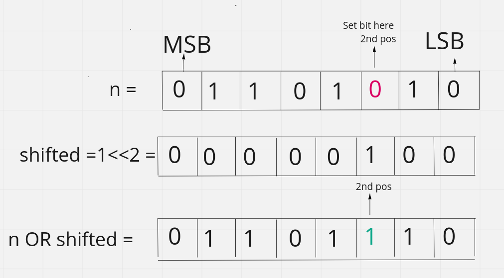

# Basic Bitwise Operation

#### 1. Set a bit on the $$n_{th}$$ position of number n:

* Left shift `1` `n` times. $$temp = 1 << n$$​
* Now do the bitwise `OR` with the `n` . $$setbit = n | temp$$
* If the bit is already set then it will remain the same.

Let's say we want to set bit on the $$4_{th}$$​position of the $$(106)_{2} = 01101010$$

$$1_{(00000001)} << 2 = 00000100 | 01101010 = (01101110 )_{10} = 110$$

<figure><figcaption></figcaption></figure>

> Binary number are considered as 0 based indexing and also start from **right to left.** That means
>
> Most right part are considered as index 0 or 0th  position. This is depends on big and little endian machine. In this case we are fllowing the little endian convention.

#### Clear/unset a bit from $$n_{th}$$position:​

* Left shift `1` `n` times. $$temp = 1 << n$$
* Do the `bitwise NOT` to unset the `bit` of the shifted bitset. ​`temp = ~temp`
* Now do the bitwise `AND` with the `n`. $$clearbit = temp \bitand number$$​$$f(x) = x * e^{ bi$$
