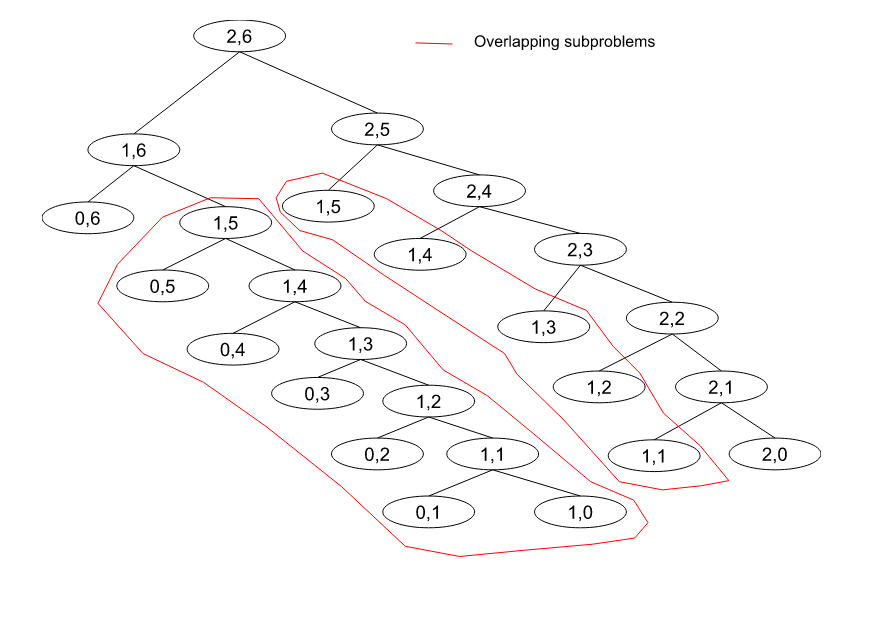

# [Leet-code] Unique Paths

### Discussion:

* We know the robot can move ether down or right.
* We will start from the ending point so the move will be oposit means up or left.
* We start from `n-1` and `m-1`. So, there can be two solution one for down and another for right move.
* So, the solution will be $f(m, n) = f(m, n-1) + f(m-1, n)$
* The base case will be if `n` or `m` reach to 0. As because for `(m, n) = (1,n) 0r (m,1)` unique paths will be 1.

eg. For $f(3,7) = f(m-1, n) + f(m, n-1) + ... ... + f(0, n) + f(m, 0)$

<figure><figcaption></figcaption></figure>

### Implementation:

```python
class Solution:
    def uniquePaths(self, m: int, n: int) -> int:
        return self.dp_unique_paths(m-1, n-1)

    def dp_unique_paths(self, m: int, n: int, dp=[]) -> int:
        # Initialize the dp.
        if not dp:
            dp = [[-1 for x in range(n+1)] for y in range(m+1)]
        # Base case.
        if m == 0 or n == 0:
            return 1
        # Return from the dp.
        if dp[m][n] != -1:
            return dp[m][n]

        ans = self.dp_unique_paths(m-1, n, dp) + self.dp_unique_paths(m, n-1, dp)
        # Store the ans in the dp.
        dp[m][n] =  ans

        return dp[m][n]
```

### Time complexity:

As here `m*n` states are occuring so the time complexity $O(m*n)$
