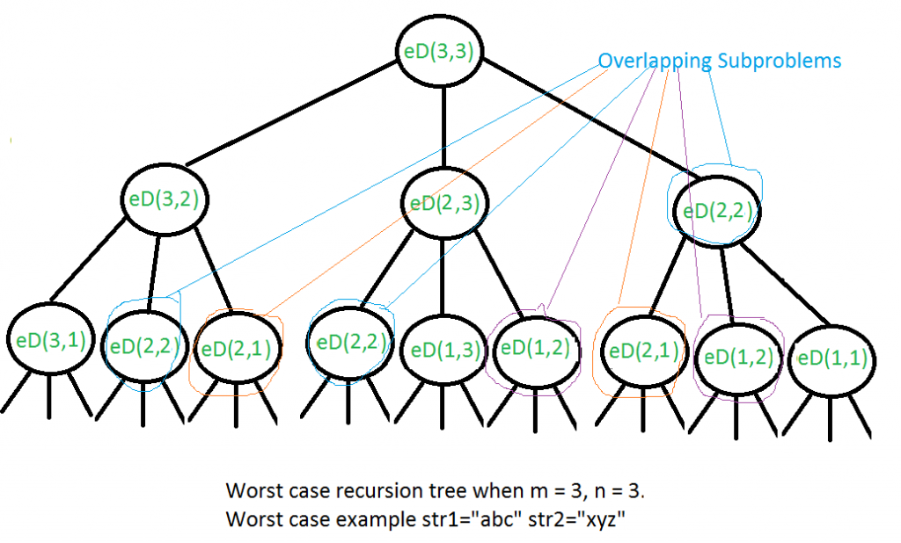

# \[Leet-code]72. Edit Distance

### Problem description



### Discussion:

Given two strings str1 and str2 and below operations that can be performed on str1. Find a minimum number of edits (operations) required to convert ‘str1’ into ‘str2’. &#x20;

1. Insert
2. Remove
3. Replace

All of the above operations are of equal cost.&#x20;


**Examples:**&#x20;

```
Input:   str1 = "geek", str2 = "gesek"
Output:  1
We can convert str1 into str2 by inserting a 's'.

Input:   str1 = "cat", str2 = "cut"
Output:  1
We can convert str1 into str2 by replacing 'a' with 'u'.

Input:   str1 = "sunday", str2 = "saturday"
Output:  3
Last three and first characters are same.  We basically
need to convert "un" to "atur".  This can be done using
below three operations. 
Replace 'n' with 'r', insert t, insert a
```


The idea is to process all characters one by one starting from the right sides of both strings. \
There are two possibilities for every pair of characters being traversed. &#x20;

```
m: Length of str1 (first string)
n: Length of str2 (second string)
```

1. If last characters of two strings are same, nothing much to do. Ignore last characters and get count for remaining strings. So we recur for lengths m-1 and n-1.
2.  Else (If last characters are not same), we consider all operations on ‘str1’, consider all three operations on last character of first string, recursively compute minimum cost for all three operations and take minimum of three values.&#x20;

    1. Insert: Recur for m and n-1
    2. Remove: Recur for m-1 and n
    3. Replace: Recur for m-1 and n-1


#### **Recursive tree**




### Reference

* __[_https://leetcode.com/problems/edit-distance/_](https://leetcode.com/problems/edit-distance/)__
* __[_https://www.geeksforgeeks.org/edit-distance-dp-5/_](https://www.geeksforgeeks.org/edit-distance-dp-5/)__
