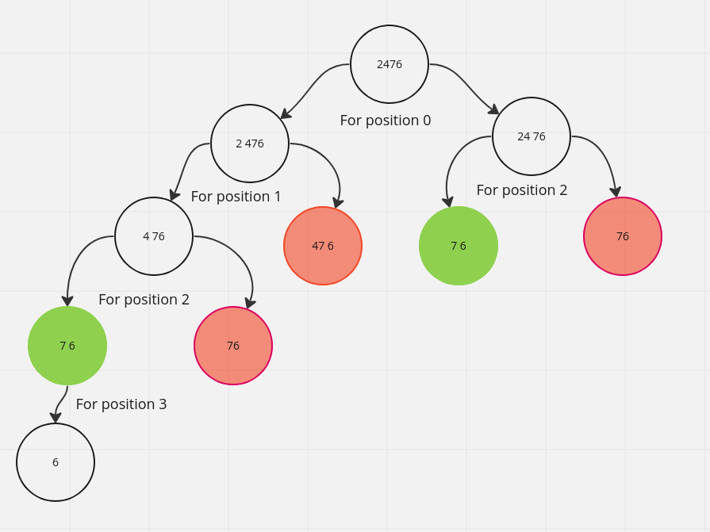

# [Leet-code] 91.  Decode Ways(url="https://leetcode.com/problems/decode-ways/description/")

### Disscusstion

Let's have an example for `24762`.

- For 1st position mean `2` there are two way to group this string.
  - `2 4762` and `24 762`

- For 2nd position `4` there are alsow two way to group this string.
  - `4 762` and `47 62`. But here `47` is not valid as we shold consider only less than `26`

- For 3rd position `7`
  - `7 62` and `76 2`. But `76` is not valid.

- For 4th position `6`
  - `6 2` and `62`. Though `62` is not valid group

- For 5th position `2` there is only one way to decode this as it is the last value.
  - `2`

Here, You can see we need the solution of `5th` position to calculate the `4th` position value. We need `4th` position value for calculating the `3rd` position and so on.

So, we are reusing the answer. Means this is a dp problem.



You can see here, for a position `i` we can find the anwer

$
f(i) = f(i+1) + f(i+2)
$

- Calculating $f(i+1)$ mean we are taking the `i` position as a single group. $f(i+2)$ mean we are taking `i and i+1` as a pair group.
- But there is a condition the group will be valid if $s[i]+s[i+1]<=26  \&  s[i] > 0$
- Here we will calculate the $f(i+2)$ if $int(s[i]+s[i+1]) <= 26$
- The base case will be 

  $
  s[i] == '0' \ then \ return \ 0 \\
  i >= len(s) \ then \ return \ 1 [we \ already \ cheked \ the \ false \ resutl \ for \ the \ single \ digit. \ so \ remain \ digit \ will \ be \ valid]
  $

### Solution

```python
class Solution:
    def numDecodings(self, s: str) -> int:
        dp = [0] * len(s)
        return self.dp_solution(s, 0, dp)
    
    def dp_solution(self, s:str, index=0, dp=[]) -> int:
        if index >= len(s):
            return 1
        if int(s[index]) == 0:
            return 0
        if dp[index]:
            return dp[index]
            
        if index+1 < len(s) and int(s[index]+s[index+1]) <= 26:
            print(s[index], [s[index+1]])
            print("h")
            dp[index] = self.dp_solution(s, index+1, dp) + self.dp_solution(s, index+2, dp)
        else:
            dp[index] = self.dp_solution(s, index+1, dp)
        
        return dp[index]
```

### Time complexity

As we are using dp that mean we just go through the `n` times. So, time complexity is
$O(n)$
